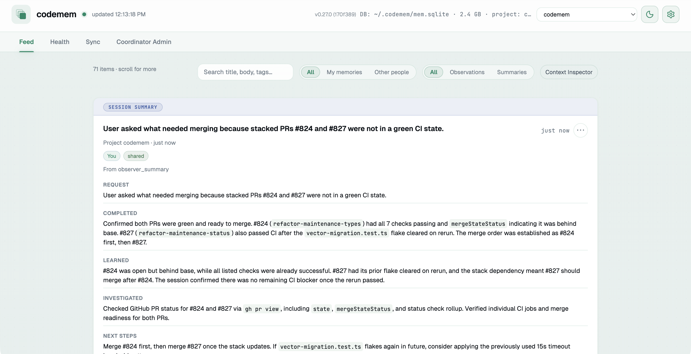
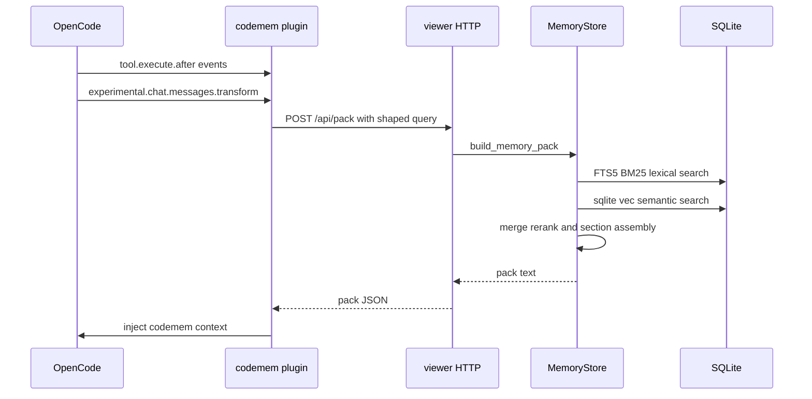

# codemem

[](https://github.com/kunickiaj/codemem/actions/workflows/ci.yml) [](https://codecov.io/gh/kunickiaj/codemem) [](https://github.com/kunickiaj/codemem/releases)

Persistent memory for [OpenCode](https://opencode.ai) and [Claude Code](https://claude.ai/code). codemem captures what you work on across sessions, retrieves relevant context using hybrid search, and injects relevant context automatically in OpenCode.

- **Local-first** — everything lives in SQLite on your machine
- **Hybrid retrieval** — FTS5 BM25 lexical search + sqlite-vec semantic search, merged and re-ranked
- **Automatic injection** — the OpenCode plugin injects context into every prompt, no manual steps
- **Claude Code support** — setup-managed MCP and bundled hooks
- **Built-in viewer** — browse memories, sessions, and observer output in a local web UI
- **Peer-to-peer sync** — replicate memories across machines without a central service

<picture>
  <source media="(prefers-color-scheme: dark)" srcset="docs/images/codemem-dark.png">
  
</picture>

## Quick start

This free-mem checkout is pre-release and has no published package. The supported
install path is deliberately source-only: build this checkout, then run its CLI by
path. npm, global `PATH`, and remote marketplace installs can select upstream
CodeMem and are not supported here.

**Prerequisites:** Node.js 24+ and pnpm

Run these commands from this `vendor/codemem` directory first:

```text
corepack pnpm install --frozen-lockfile
corepack pnpm run build
```

### Claude Code and Codex

Plain setup is the Slice 1 activation flow for both supported Agent lanes:

```text
node packages/cli/dist/index.js setup
```

It discloses the complete provider destination and non-secret credential reference, asks for
confirmation, and then installs Claude Code and Codex together. OpenCode remains available only
through the explicit compatibility lane below.

This pre-release setup requires a stopped daemon. After setup succeeds, start it manually, then restart both
Agent clients:

```text
node packages/cli/dist/index.js serve start
```

### OpenCode

Install the checkout-pinned OpenCode wrapper and MCP config:

```text
node packages/cli/dist/index.js setup --opencode-only
```

Then restart OpenCode. Setup records the absolute built CLI and plugin source in
the ownership manifest; rebuild and rerun setup after moving or updating the
checkout.

Verify with the same built CLI:

```text
node packages/cli/dist/index.js stats
node packages/cli/dist/index.js db raw-events-status
```

That's it. The plugin captures activity, builds memories, and injects context from here on.

### Claude Code

Install the checkout-pinned MCP config and bundled hooks:

```text
node packages/cli/dist/index.js setup --claude-only
```

Setup honors `CLAUDE_CONFIG_DIR`, copies the standalone hook runtime into that
config directory, writes the user MCP entry to
`$CLAUDE_CONFIG_DIR/.claude.json`, and merges all seven hook groups into
`settings.json` while preserving unrelated state, settings, and hooks. Without
the override it uses `~/.claude.json` for MCP and `~/.claude` for hooks. It also
disables the exact legacy local plugin entry when enabled so events are not
delivered twice. Rebuild and rerun setup to refresh both MCP and hooks.

Claude hooks use daemon RPC and the shared bounded spool; they never open SQLite.
`UserPromptSubmit` captures the event and returns recalled context through Claude
`additionalContext`.

### Codex (early beta)

Codex support is **early beta**. Configure it directly from this checkout:

```text
node packages/cli/dist/index.js setup --codex-only
```

This writes an absolute built-CLI MCP entry, copies the bundled standalone hook
runtime, and merges the hook configuration while preserving unrelated entries.
Restart Codex and approve the one-time hook trust prompt.

Codex hooks deliver redacted normalized events over daemon RPC and use the shared bounded spool when RPC is unavailable. `UserPromptSubmit` delivers the prompt while requesting memory context for `additionalContext`; disable injection with `CODEMEM_INJECT_CONTEXT=0`. See [docs/plugin-reference.md](docs/plugin-reference.md) for details and troubleshooting.

Both bundled hook runtimes keep worker readiness separate from the 100 ms redaction scan and
reserve 500 ms for fail-closed spool fallback. Repeated startup failures probe readiness instead
of paying the startup wait again.

When either hook runtime falls back to the spool, `ENOENT` from post-publication
or stale-lock revalidation is treated as contention and retried within the
bounded lock deadline. Other errors from those revalidation reads remain spool
failures.

> Migrating from `opencode-mem`? See [docs/rename-migration.md](docs/rename-migration.md).

## How it works

Adapters hook into runtime event systems (OpenCode plugin and Claude hooks). They capture tool calls and conversation messages, flush them through an observer pipeline that produces typed memories, and surface retrieval context for future prompts.



**Retrieval** combines two strategies: keyword search via SQLite FTS5 with BM25 scoring and semantic similarity via sqlite-vec embeddings. In the pack-building path, results from both are merged, exactly deduplicated, and re-ranked using recency and memory-kind boosts. Near-related memories stay fully rendered by default; use compact rendering or `CODEMEM_PACK_COMPRESSION=ids` only when you intentionally want ID-based expansion via `memory_get_observations`.

**Injection** happens automatically. The plugin builds a query from the current session context (first prompt, latest prompt, project, recently modified files), asks the long-lived local viewer to build the pack, and appends the result to the latest user message via `experimental.chat.messages.transform`. Before sending prompt-derived POST data, it performs a payload-free viewer/profile handshake and rejects redirects. Retryable viewer transport, version, database-target, effective identity/config-target, compression-setting, or embedding-setting mismatch failures fall back to the existing CLI path; only structured, validated request errors are terminal. Prior injected message blocks are replayed byte-for-byte on later turns so provider prompt caches can keep the stable prefix. Set `CODEMEM_INJECT_SURFACE=system` to use the legacy system-prompt surface. OpenCode raw-event capture streams through the viewer and falls back to direct CLI enqueue; explicit SQLite busy/locked results and command timeouts receive one idempotent retry with the same event ID, while terminal failures are reported and dropped instead of requeued. Each retrieval and current-request cache reuse is recorded through the viewer-backed local evidence ledger with bounded memory identities, machine-readable reason codes, delivery status, and safe repository-relative working-set paths; retryable ledger transport failures retain the CLI fallback. Repository-contained absolute tool paths are converted to repository-relative `/` paths before retrieval; outside-repository, traversing, blank, and overlong paths are omitted. Prompts, pack text, memory content, and absolute paths are not copied into the ledger, historical message reconstruction creates no new attempts, and recording failures never block injection. After a plugin restart, usable context also remains fail-open when fresh ledger-identity repair fails; fallback bytes are injected without attributing delivery to either the conflicted or failed attempt.

**Memories** are typed — `bugfix`, `feature`, `refactor`, `change`, `discovery`, `decision`, `exploration` — with structured fields like `facts`, `concepts`, `files_read`, and `files_modified` that improve retrieval relevance. Low-signal events are filtered at multiple layers before persistence.

**Reserved markup** lets you control capture from inside the text itself. `<private>…</private>` removes the block and marks the record private, `<local-only>…</local-only>` keeps the content and flags the record local-only — it stays out of memory packs and hook prompt capture, and the raw-event flush never sends it to a remote or unverified summary provider (see the user guide, and [#130](https://github.com/ojungo69/free-mem/issues/130)), and `<injected-context>…</injected-context>` is what adapters wrap injected context in so it is not captured back as your own writing. A one-sided `<private>` or `<injected-context>` tag has an unknown extent, so the surrounding content is removed and a marker naming that tag — `[private]`, `[/injected-context]`, and so on — is left in its place; the redaction stays visible instead of silently emptying the record. See [docs/user-guide.md](docs/user-guide.md#reserved-markup-in-memory-text).

For architecture details, see [docs/architecture.md](docs/architecture.md).

## CLI

| Group | Command | Description |
|-------|---------|-------------|
| **Core** | `codemem status` | Local operational roll-up (`--json` supported) |
| | `codemem stats` | Database statistics |
| | `codemem stats --attribution` | Bounded local retrieval-attribution diagnostics (`--json` supported) |
| | `codemem recent` | Recent memories |
| | `codemem search <query>` | Search memories |
| | `codemem pack <context>` | Build a context-aware memory pack |
| | `codemem pack trace <context>` | Inspect retrieval and pack assembly for a manual query |
| | `codemem distill` | Mine recurring memories into reviewable context candidates |
| | `codemem embed` | Backfill semantic embeddings |
| **Memory** | `codemem memory show <id>` | Print a memory item as JSON |
| | `codemem memory forget <id>` | Deactivate a memory item |
| | `codemem memory remember` | Manually add a memory |
| | `codemem memory inject <context>` | Raw pack text for prompt injection |
| | `codemem memory export <output>` | Export memories by project |
| | `codemem memory import <file>` | Import memories (idempotent) |
| **Viewer** | `codemem serve [start\|stop\|restart]` | Launch / manage the web viewer |
| **Sync** | `codemem sync enable\|disable` | Enable or disable peer-to-peer sync |
| | `codemem sync status` | Device info and peer health |
| | `codemem sync pair` | Advanced/legacy device pairing |
| | `codemem sync once` | Run one immediate sync pass |
| | `codemem sync doctor` | Diagnose sync configuration issues |
| | `codemem sync bootstrap` | Bootstrap sync from a peer snapshot |
| **Coordinator** | `codemem coordinator` | Self-hosted coordinator admin (groups, devices, invites) |
| **Database** | `codemem db prune-memories` | Deactivate low-signal memories (`--dry-run` to preview) |
| | `codemem db prune-observations` | Deactivate low-signal observations |
| | `codemem db backfill-tags` | Populate missing `tags_text` values |
| | `codemem db raw-events-status` | Show raw-event queue status |
| | `codemem db raw-events-doctor-retry <job-id>` | Inspect one exhausted processing job and explicitly confirm a one-shot retry |
| **Config** | `codemem config` | View or update configuration |
| | `codemem setup` | Interactive first-run setup |
| **Plumbing** | `codemem mcp` | MCP stdio client for the local sole-writer daemon |
| | `codemem claude-hook-ingest` | Claude hook event ingestion (stdin) |
| | `codemem codex-hook-ingest` | Codex hook event ingestion (stdin, experimental) |
| | `codemem codex-hook-inject` | Codex prompt-time memory injection (stdin, experimental) |

Run `codemem --help` for the full list. `show`, `forget`, and `remember` still work as hidden top-level aliases. `export-memories` and `import-memories` remain visible but are deprecated — they warn on stderr and will be hidden from help and completion in a future release; use `codemem memory export` / `codemem memory import`.

Use `codemem status` to answer whether the local database, viewer, sync, maintenance,
semantic index, raw-event ingestion, and observer need attention. It is observational:
it does not create a missing database, repair state, inspect credentials, or contact
peers, coordinators, registries, or non-loopback hosts. Use `codemem status --json`
for the stable machine-readable report. `codemem stats` remains the inventory and
usage command; use `sync status`/`sync doctor`, `maintenance status`, and
`db raw-events-status` for subsystem detail.

Pack rendering defaults to self-contained context. For token-constrained experiments, `codemem pack <context> --compact` renders an index plus top details. Near-related compression is controlled by `--compression-mode off|compact|ids` (or `CODEMEM_PACK_COMPRESSION`). Use `ids` only when the agent can follow up with `memory_get_observations`.

### Distill recurring lessons

`codemem distill` finds repeated discoveries and decisions that may be worth promoting into project or user context.

```text
codemem distill --explain               # ranked candidates + evidence
codemem distill --all-projects --json   # machine-readable
codemem distill --no-judge              # skip the observer-model worthiness judgment
codemem distill --draft                 # draft an AGENTS.md rule for the top candidate and show a diff
codemem distill --draft --apply         # write it after confirmation
```

Candidate mining is deterministic, and by default an observer-model worthiness pass then drops clusters of recurring routine activity (release/CI status, review passes with no findings, context lookups) that recurrence scoring cannot distinguish from real lessons. Without a configured observer model the command falls back to unjudged output with a warning; `--no-judge` opts out entirely. `--draft` uses your configured observer model to turn the top candidate into a single `AGENTS.md` rule and renders a unified diff; nothing is written. `--apply` writes that rule into a codemem-managed `## Distilled lessons` block (delimited by `<!-- codemem:distilled:begin/end -->` markers, so all distilled edits stay in one place) after prompting for confirmation.

## MCP tools

To give the LLM direct access to the Phase 1 memory tools (read, remember, and daemon status):

```text
node packages/cli/dist/index.js setup --opencode-only
```

This updates your OpenCode config to install the plugin and register the MCP server. Restart OpenCode to activate.

The standalone `codemem-mcp-ts` binary runs the same stdio server used by `codemem mcp`. It never opens SQLite or starts the viewer. Read tools return a typed `daemon_unavailable` error when the local daemon is down; `memory_remember` instead queues the same pre-redacted request in the shared atomic spool. User-authority mutations such as forget, confirm, pin, retract, and destructive bulk actions are deliberately absent from the agent-callable MCP surface.

## Configuration

Legacy config resolution precedence used by setup migration is:

1. explicit `CODEMEM_CONFIG`
2. workspace-scoped config derived from `CODEMEM_RUNTIME_ROOT` or `CODEMEM_WORKSPACE_ID`
3. legacy global config at `~/.config/codemem/config.json{c}`

These files and `CODEMEM_OBSERVER_*` variables do not override the active runtime after setup.

Common overrides:

| Variable | Purpose |
|----------|---------|
| `CODEMEM_DB` | SQLite database path |
| `CODEMEM_INJECT_CONTEXT` | `0` to disable automatic context injection |
| `CODEMEM_INJECT_SURFACE` | `message` (default) to inject near the latest OpenCode user message; `system` for the legacy OpenCode system-prompt surface |
| `CODEMEM_VIEWER_HOST`, `CODEMEM_VIEWER_PORT` | Host/port the plugin-managed viewer should start, probe, and restart |
| `CODEMEM_VIEWER_AUTO` | `0` to disable auto-starting the viewer |

Viewer note:

- The plugin manages one explicit viewer target per runtime. If you run multiple viewers, give each one its own DB/runtime folder instead of sharing `viewer.pid` state next to the same SQLite file.
- The OpenCode plugin monitors viewer liveness through `GET /api/health`. When an older viewer returns `404`, it makes one compatibility probe to the legacy raw-event status endpoint; raw-event ingest preflight remains separate and is bounded by a 5-second timeout.

The viewer Settings modal is read-only for provider state and renders the frozen safe capability
snapshot. Use `codemem setup` to activate a replacement manifest.
- The viewer HTTP service is intended for localhost-only use. It does not currently provide a general-purpose auth/session layer for safe public exposure.

Observer runtime/auth is compiled only by setup: exact wire protocol, complete endpoint, exact model
ID/revision, and either no credential or one named environment-variable reference. Setup reports the
choice but keeps provider execution disabled until the privacy boundary lands.

## Export and import

Share project knowledge with teammates or back up memories across machines.

```text
# Export current project
codemem memory export project.json

# Import on another machine (idempotent, safe to re-run)
codemem memory import project.json --remap-project ~/workspace/myproject
```

See `codemem memory export --help` and `codemem memory import --help` for full options. The legacy top-level `export-memories` / `import-memories` forms still work but emit a deprecation warning.

## Sharing and devices

Share selected project memories with a teammate, or use the same Project-first model to understand your own devices. The viewer's normal workflow is **Projects → Sharing → Devices → Health**; open **Sharing → Teams** to manage ongoing Team membership and inherited Project access. Sync internals live under **Advanced**.

### Share projects with a teammate

For ongoing collaboration:

1. Assign exact Projects to a **Team**.
2. Invite people to join it.

Team onboarding links Identities and devices. The invitation does not assign Projects to the Team, but a new member inherits every current and future Project assigned to it. Review the Team's Projects before sending or accepting the invitation. Use **Share exact Projects** to send a separate direct Project invitation to one Identity. Team sharing must already be configured, but accepting the direct invitation does not add the recipient to the Team.

For a direct share, choose **Create an invitation → Share exact Projects**:

1. Choose or enter the teammate's **Identity display name**.
2. Select the exact projects to share and review each existing-memory count.
3. Confirm that existing memories **and future activity** from those projects will share, then send the one expiring invite.
4. The recipient reviews and accepts the invitation, then confirms their Identity and device display names. Codemem establishes trust and Project access, then starts the first sync.

Only the reviewed canonical projects are shared—similarly named or sibling projects are not included. A memory marked **Only me** stays local even when its project is shared. Removing access stops future sharing; memories already copied to another device may remain there.

### Add, disable, or restore devices

When an Identity adds another device, codemem shows the exact Projects it will inherit from direct shares and Team policies. Existing exclusions stay excluded. Review that list before sending the add-device invitation; acceptance links the new device to the same Identity without widening Project access.

Disabling a device's enrollment for one coordinator group revokes future delivery only for that group's Projects. The global identity device stays active in **Devices** and can retain access through other groups. In **Advanced → Team administration**, re-enable that group enrollment; the next owner reconciliation pass then restores only the Projects currently authorized through direct shares and Team policies for that group. An offline device simply waits: it keeps its access and catches up when it reconnects. A separate global identity-device revocation removes the device from the active **Devices** list. Neither action remotely erases copied memories.

### Check devices and health

**Devices** is read-only. Each card shows the device's **Owning Identity**, whether it is available, and the Projects it receives:

- **Direct** — the Project was shared with that Identity.
- **Team** — the Identity receives the Project through a Team policy.
- **Waiting** — acceptance, setup, or delivery is waiting; an offline device resumes on reconnect.
- **Needs attention** — setup reached a terminal failure; use the displayed retry action.

Use **Health** for the current status. Globally revoked identity devices are omitted from the active Devices list. A device disabled only for one coordinator group remains listed; use **Advanced → Team administration** to review or re-enable that group enrollment. Removing access prevents future delivery, but cannot erase a copy already delivered to another device.

### Advanced and compatibility

Manual pairing, actor assignment, Spaces, grants, project mappings, and coordinator administration remain available for same-person devices, existing integrations, and diagnostics. They are not required for normal teammate sharing. Existing `#sync` and `#sync/diagnostics` links remain supported as Advanced compatibility routes. See [the user guide](docs/user-guide.md#advanced-operator-and-compatibility-guidance).

### Advanced and legacy device pairing

Use manual pairing only for a same-person device, an existing integration, or a compatibility workflow:

```text
codemem sync enable        # generate device keys
codemem sync pair          # generate pairing payload
codemem serve start        # start it; use serve stop/restart for lifecycle management
codemem sync once          # run one immediate sync pass
```

Legacy pairing and legacy coordinator invitations do not grant project access by themselves. For advanced access details, compatibility, and recovery, see [the user guide](docs/user-guide.md).

For cross-network setups where peer addresses change frequently or mDNS does not cross VPN/network boundaries, codemem also supports optional coordinator-backed discovery with a self-hosted coordinator. The preferred deployment path is the built-in `codemem coordinator` service; see [docs/coordinator-discovery.md](docs/coordinator-discovery.md).

## Semantic recall

Embeddings are stored in sqlite-vec and written automatically when memories are created. Use `codemem embed` to backfill existing memories. If sqlite-vec cannot load, keyword search still works.

## Alternative install methods

<details>
<summary>Local development</summary>

### Local development

```text
corepack pnpm install --frozen-lockfile
corepack pnpm run build
node packages/cli/dist/index.js --help
```

### Plugin for development

Start OpenCode inside the codemem repo directory — the plugin auto-loads from `.opencode/plugin/`.

</details>

## Documentation

- [Architecture](docs/architecture.md) — data flow, retrieval, observer pipeline, design tradeoffs
- [Coordinator-backed discovery](docs/coordinator-discovery.md) — self-hosted cross-network peer discovery
- [User guide](docs/user-guide.md) — Projects, Sharing, Devices, Health, and Advanced operations
- [Coordinator deployment](docs/coordinator-deployment.md) — advanced operator deployment and discovery
- [Coordinator E2E runbook](docs/coordinator-e2e-runbook.md) — advanced coordinator validation
- [Plugin reference](docs/plugin-reference.md) — plugin behavior, env vars, stream reliability
- [Migration guide](docs/rename-migration.md) — migrating from `opencode-mem`
- [Contributing](CONTRIBUTING.md) — development setup, tests, linting, releases
