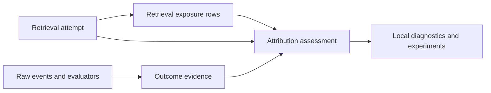

# Outcome and Retrieval-Attribution Ledger Design

**Status:** Approved design
**Date:** 2026-08-03
**Tracking:** `codemem-3lws.1.1`
**Contract version:** 1

## Purpose

Codemem can explain what it retrieved and can estimate pack cost, but it cannot
reliably connect a retrieval to later actions or task outcomes. Existing
`usage_events` rows and `PackTrace` objects answer questions such as which
memories were selected and how many tokens a pack contained. They do not prove
that the context reached the model, changed an action, improved quality, reduced
exploration, or introduced stale guidance.

This design adds a bounded, local-only evidence ledger. It records retrieval
attempts, the memories considered or handed off, independent downstream evidence,
and versioned assessments that connect the two without turning temporal
correlation into a causal claim.

The first purpose of the ledger is product evaluation. It is not an employee
analytics system, a general telemetry warehouse, or a per-memory return-on-
investment calculator.

## Decisions

1. **The retrieval attempt is the primary unit of analysis.** A delivered pack
   can be assessed as a unit. A single memory receives its own attribution only
   when evidence isolates it.
2. **Quality is primary.** Validated task quality is the primary outcome;
   efficiency is secondary; source-location steering is a diagnostic mechanism.
3. **Evidence remains dimensional.** Codemem does not collapse quality,
   efficiency, mechanism, safety, and user feedback into a productivity score.
4. **Ordinary sessions remain observational.** Only a preregistered randomized
   experiment may support a causal efficacy claim.
5. **No exposure means no attribution.** Candidate retrieval, output selection,
   handoff to an adapter, and confirmed use are distinct states.
6. **Unknown is the default.** Missing evidence does not mean irrelevant, and a
   successful task does not mean every retrieved memory helped.
7. **The ledger is local-only by default.** It is not replicated, uploaded, or
   included in ordinary export surfaces.
8. **Instrumentation is non-blocking.** Failure to record evidence must never
   break retrieval, injection, capture, or MCP tool execution.

## Goals

- Connect a specific retrieval attempt to downstream actions and quality signals.
- Distinguish retrieval, selection, handoff, explicit use, and unknown use.
- Preserve enough retrieval-time state to investigate stale guidance later.
- Support prompt packs, file-context retrieval, and explicit MCP retrieval under
  one contract.
- Support deterministic checks, evaluator judgments, efficiency measures,
  mechanism signals, and explicit user feedback.
- Make every derived attribution reproducible through a named, versioned method.
- Bound storage, cardinality, and sensitive content.
- Prepare trustworthy inputs for a later randomized repeated-work study.

## Non-goals

- Capturing private model reasoning or chain-of-thought.
- Inferring employee performance, developer productivity, or individual value.
- Assigning monetary value or time savings to individual memories.
- Treating existing `tokens_saved` or `avoided_work_tokens` estimates as outcomes.
- Inferring job spans, tasks, or interventions in the production schema.
- Central collection, organization-wide dashboards, or cross-user surveillance.
- Server-side search, ranking, or evaluation.
- Proving causality from normal session timelines.

## Existing foundation and gaps

### Existing foundation

- `usage_events` records pack token counts, `pack_item_ids`, pack deltas, and
  estimated avoided work.
- `PackTrace` version 1 records query inputs, candidate ranks, score components,
  dispositions, selected sections, trimming, and final pack output.
- Prompt injection, Claude file-context retrieval, and MCP memory tools already
  expose the principal retrieval surfaces.
- Normalized raw events provide source, stream, runtime session, event sequence,
  and wall-clock correlation.
- Sessions, prompts, tests, tool calls, and replay/evaluation infrastructure can
  supply independent downstream evidence.

### Gaps

- A trace-only pack is not persisted.
- Pack construction does not prove adapter handoff.
- MCP search and lookup tools do not emit retrieval events.
- File-context retrieval emits text logs rather than structured evidence.
- Local memory IDs and current memory content do not preserve the exact revision
  retrieved at an earlier time.
- Existing savings metrics are estimates derived from memory metadata, not
  measured outcome changes.
- No stable object links retrievals to later checks, actions, or assessments.

## Conceptual model

The implementation uses four logical records:

1. `retrieval_attempts`: one invocation of a retrieval surface.
2. `retrieval_exposures`: bounded candidate and selected-memory state for that
   attempt, including whether each selected item crossed the consumer boundary.
3. `outcome_evidence`: independently observed or evaluated downstream facts.
4. `attribution_assessments`: versioned links between an attempt or isolated
   exposure and outcome evidence.

The names describe the contract. The implementation may use internal helper
types, but it must preserve these boundaries and semantics.

## Stable identity and correlation

### Retrieval attempt identity

The caller creates `attempt_id` before retrieval starts. It is a UUID string and
is stable across process boundaries, retries, and adapter handoff. This allows an
attempt to be recorded even when retrieval or delivery fails.

Each attempt may also carry these nullable correlation fields:

- `session_id`: local normalized session row.
- `source`: adapter source such as `opencode`, `claude`, `codex`, or `mcp`.
- `stream_id`: normalized adapter stream identity.
- `source_session_id`: source-native session identifier.
- `prompt_number`: source-native prompt or turn number when available.
- `request_id`: caller-provided idempotency key for one adapter request.
- `raw_event_start_seq` and `raw_event_end_seq`: bounded event range when known.
- `experiment_id` and `experiment_cell_id`: present only for controlled studies.

No correlation field is required to fabricate a session. Missing correlation is
stored as unknown rather than attached to the most recent unrelated session.

### Memory identity at retrieval time

Each exposure records:

- local `memory_id`, nullable after deletion;
- `memory_import_key` when available;
- `origin_device_id` when available;
- `memory_rev` at retrieval time;
- `memory_updated_at` at retrieval time;
- `memory_scope_id` at retrieval time;
- memory kind and active/deleted state at retrieval time.

The snapshot fields allow later stale-guidance analysis without copying memory
body text into the ledger. A change to the current memory row does not rewrite
historical exposure state.

## Retrieval-attempt contract

### Required fields

| Field | Type | Meaning |
|---|---|---|
| `attempt_id` | UUID text | Caller-generated stable identity |
| `contract_version` | integer | Evidence contract version; initially `1` |
| `surface` | enum text | Retrieval surface |
| `trigger` | enum text | `automatic`, `explicit`, or `evaluation` |
| `started_at` | timestamp | Attempt start |
| `retrieval_status` | enum text | Terminal retrieval result |
| `delivery_status` | enum text | Consumer-boundary handoff result |
| `candidate_count` | integer | Total candidates before bounded persistence |
| `selected_count` | integer | Items selected into output |
| `persisted_candidate_count` | integer | Candidate rows retained in the ledger |
| `recorder_version` | text | Code/rule version that emitted the row |

### Initial retrieval surfaces

- `prompt_pack`
- `file_context`
- `mcp_search`
- `mcp_search_index`
- `mcp_pack`
- `mcp_get`
- `mcp_timeline`
- `mcp_expand`
- `mcp_explain`
- `evaluation_replay`

New surfaces require a contract update or a backward-compatible enum extension.
They must not overload an existing surface with different delivery semantics.

### Retrieval status

- `succeeded`: retrieval completed and produced a result, even if selection was
  empty after filtering.
- `no_results`: retrieval completed with no candidates.
- `skipped`: policy or configuration intentionally bypassed retrieval.
- `failed`: retrieval raised or returned an error.
- `unknown`: legacy or partial instrumentation cannot determine the result.

### Delivery status

“Delivery” means crossing the immediate Codemem consumer boundary. It does not
mean the model read, understood, or used the context.

- `not_attempted`: no output was available for handoff.
- `handed_off`: the plugin added context to its outbound message, a hook returned
  additional context, or an MCP handler returned content to the SDK boundary.
- `failed`: the adapter could not hand off the produced output.
- `unknown`: the surface cannot confirm handoff.

Reports use “handed off,” not “consumed,” unless explicit use evidence exists.

### Optional bounded fields

- `completed_at`
- `latency_ms`
- `project`
- `scope_id`
- `mode`
- `limit_requested`
- `token_budget`
- `output_tokens`
- `working_set_file_count`
- `filter_summary_json`
- `failure_code`
- `failure_stage`
- `trace_version`
- `retention_until`

`filter_summary_json` contains an allowlisted, size-bounded summary. It must not
become a copy of arbitrary request input.

## Retrieval input privacy

The ledger does not persist raw prompts, raw search queries, pack text, memory
bodies, or absolute filesystem paths by default.

For correlation and diagnostics, it may persist:

- a SHA-256 hash of the sanitized effective query;
- query character and token estimates;
- normalized repository-relative file paths;
- a count of working-set paths;
- the effective project and scope filters;
- the version of the sanitizer and retrieval policy.

An explicit local debugging option may retain raw retrieval input for a short,
clearly displayed retention period. It is off by default and out of scope for the
first implementation slice.

## Retrieval-exposure contract

The ledger stores every selected or returned memory, up to the existing
surface-level maximum of 50, plus at most the top 20 unselected diagnostic
candidates. This preserves the complete handed-off set while preventing candidate
fan-out from becoming unbounded telemetry. The current `PackTrace` top-20 bound
supplies the unselected diagnostic pool.

| Field | Type | Meaning |
|---|---|---|
| `exposure_id` | local integer | Stable local row identity |
| `attempt_id` | UUID text | Parent retrieval attempt |
| `memory_id` | nullable integer | Current local memory row when retained |
| `memory_import_key` | nullable text | Stable memory identity snapshot |
| `rank` | positive integer | Retrieval rank before assembly |
| `disposition` | enum text | Selection/assembly result |
| `section` | nullable enum text | Pack section when selected |
| `handoff_status` | enum text | Whether this item crossed the consumer boundary |
| `memory_rev` | nullable integer | Revision retrieved |
| `memory_updated_at` | nullable timestamp | Revision timestamp retrieved |
| `memory_scope_id` | nullable text | Scope at retrieval time |
| `score_summary_json` | nullable JSON | Bounded allowlisted score components |
| `reason_codes_json` | nullable JSON | Stable terse reason codes, not reasoning text |

Initial dispositions are `selected`, `dropped`, `deduped`, `trimmed`, and
`compressed`. Candidate rows that were not selected always have
`handoff_status=not_attempted`.

Selected pack items become `handed_off` only when the attempt's adapter confirms
handoff. A generated pack whose plugin later fails therefore remains selected but
not handed off.

## Outcome-evidence contract

Outcome evidence is recorded independently of whether Codemem retrieval occurred.
This is required for control cells and prevents retrieval code from grading
itself.

### Required fields

| Field | Type | Meaning |
|---|---|---|
| `evidence_id` | UUID text | Stable evidence identity |
| `contract_version` | integer | Evidence contract version |
| `dimension` | enum text | Quality, efficiency, mechanism, safety, or feedback |
| `evidence_type` | enum text | Concrete measured signal |
| `source_class` | enum text | How the evidence was obtained |
| `observed_at` | timestamp | Observation time |
| `producer` | text | Recorder, evaluator, or rule name |
| `producer_version` | text | Version needed for replay |
| `status` | enum text | `pass`, `fail`, `mixed`, `present`, or `unknown` |

Evidence may reference a session, source stream, prompt number, raw-event range,
experiment cell, or bounded downstream window. It does not require a production
job-span object.

### Outcome dimensions and initial evidence types

#### Quality — primary

- `quality.task_assertion`
- `quality.test_result`
- `quality.typecheck_result`
- `quality.lint_result`
- `quality.build_result`
- `quality.blinded_evaluator`
- `quality.corrective_followup`

Quality evidence records the check identity, pass/fail/mixed state, and available
counts. A generic successful shell exit is not automatically a task assertion.

#### Efficiency — secondary

- `efficiency.elapsed_ms`
- `efficiency.tool_call_count`
- `efficiency.exploration_call_count`
- `efficiency.files_read_count`
- `efficiency.files_read_before_target`
- `efficiency.retrieval_overhead_ms`
- `efficiency.retrieval_overhead_tokens`

Efficiency measures are descriptive in ordinary sessions. Duration or fewer tool
calls do not imply better work when quality differs.

#### Mechanism — diagnostic

- `mechanism.source_location_match`
- `mechanism.memory_reference`
- `mechanism.command_or_constraint_reuse`
- `mechanism.retrieval_followup`

A source-location match means a retrieved memory named a repository-relative file
that later became a gold, read, or modified file according to the evidence
producer. It explains a plausible steering mechanism; it is not task success.

#### Safety and relevance

- `safety.stale_guidance`
- `safety.contradicted_guidance`
- `safety.wrong_action_followup`
- `safety.retrieval_noise`

Stale or contradicted guidance requires a grounded source, such as repository
state at the evaluated checkout or explicit human adjudication. Age alone is not
staleness.

Assessment-time qualification keeps diagnostic capture separate from impact
classification. `safety.wrong_action_followup` supports `harmful` only when an
observed or derived row names the evaluated checkout, or an evaluator row names
a rubric or adjudication. `safety.retrieval_noise` supports `irrelevant` only
when an evaluator row names a rubric or adjudication. Ungrounded rows remain
linkable evidence for an `unknown` assessment, but cannot support a known impact
label.

#### Explicit feedback — supporting

- `feedback.explicit_helpful`
- `feedback.explicit_irrelevant`
- `feedback.explicit_stale`
- `feedback.explicit_harmful`
- `feedback.explicit_correction`

Codemem records feedback only from a structured feedback action or unambiguous
explicit instruction. It does not run sentiment analysis on ordinary user text,
and it does not treat politeness as acceptance.

### Source classes

- `observed`: directly captured deterministic fact.
- `derived`: produced by a named deterministic or statistical rule.
- `evaluator`: produced by a blinded model or human rubric.
- `user_reported`: explicitly supplied by the user.
- `experiment`: supplied by the controlled-study harness.

Unknown values remain unknown. The recorder must not estimate unavailable token
usage, elapsed time, or check results from text length or vague transcript cues.

## Attribution-assessment contract

An assessment links exactly one retrieval attempt or one isolated exposure to one
or more outcome-evidence records. Attempt-level assessment is the default.

### Required fields

| Field | Type | Meaning |
|---|---|---|
| `assessment_id` | UUID text | Stable assessment identity |
| `subject_type` | enum text | `attempt` or `exposure` |
| `attempt_id` | UUID text | Retrieval attempt being assessed |
| `exposure_id` | nullable integer | Present only for isolated memory assessment |
| `dimension` | enum text | Outcome dimension assessed |
| `impact_label` | enum text | Helpful, irrelevant, stale, harmful, or unknown |
| `basis` | enum text | Evidence relationship used |
| `confidence_level` | enum text | Low, medium, or high |
| `method` | text | Human/evaluator/rule/experiment method |
| `method_version` | text | Reproducible assessment version |
| `created_at` | timestamp | Assessment creation time |

The many-to-many relationship between assessments and evidence records uses a
join table or equivalent normalized representation. Assessments must not embed
copies of evidence payloads.

### Basis values

- `temporal_followup`: downstream evidence occurred after handoff.
- `source_location_overlap`: retrieved paths overlap grounded downstream paths.
- `explicit_reference`: a downstream action or feedback explicitly identifies
  the attempt or memory.
- `content_overlap`: a bounded deterministic rule found a specific reused command
  or constraint.
- `human_review`: a reviewer applied a published rubric or recorded an explicit
  adjudication; the evaluator evidence must include that grounding identifier.
- `blinded_evaluator`: an evaluator applied a versioned blinded rubric.
- `randomized_contrast`: a preregistered experiment compared assigned cells.

Repeated attempts sharing the same fixture within one cell are ambiguous by
construction, so repeated-work experiments require `checkout_id` correlation.
Evidence-side checkout or fixture identifiers are enforced only when attempts in
that cell carry evaluation-replay identifiers; otherwise the singleton fallback
preserves legacy experiment evidence.

Temporal followup alone cannot produce `helpful`, `irrelevant`, or `harmful` with
high confidence. It normally remains `unknown` and serves only as a joinable
timeline fact.

### Impact-label semantics

- `helpful`: evidence supports that the handed-off retrieval contributed useful
  information or reduced work without degrading primary quality.
- `irrelevant`: explicit review or controlled evidence supports that the
  retrieval did not bear on the work. Lack of an observable reference is not
  enough.
- `stale`: grounded evidence shows that retrieved guidance was outdated or
  contradicted at the time of use or review.
- `harmful`: grounded evidence links retrieval to a wrong action, quality failure,
  or material avoidable overhead.
- `unknown`: evidence is absent, conflicting, or insufficient.

No assessment row is also meaningful: it means the attempt has not been
assessed. An explicit `unknown` row means an assessment ran and found insufficient
evidence. Diagnostics must distinguish these states.

### Confidence semantics

- `low`: weak or indirect observational evidence.
- `medium`: multiple consistent observational signals or one grounded evaluator.
- `high`: explicit isolated use with grounded outcome evidence, strong human
  adjudication, or a controlled estimate meeting its preregistered criteria.

Confidence describes evidence strength, not effect size or causal certainty.
Randomized analyses report effect estimates and uncertainty separately.

## Per-memory attribution gate

An assessment may set `subject_type=exposure` only when at least one condition is
true:

1. the attempt handed off exactly one memory;
2. a downstream action explicitly references the memory identity;
3. a file-context result isolated that memory and the grounded action used the
   surfaced file or constraint;
4. explicit user feedback identifies the memory;
5. a controlled ablation or randomized evaluation isolates the memory.

Otherwise assessment remains at attempt level. A pack containing five memories
cannot assign the pack's outcome to all five memories.

## Language and causal-claim policy

Ordinary local reports may say:

- “Pack A was handed off before test result B.”
- “Pack A named two files later read by the agent.”
- “A versioned evaluator classified Pack A as stale.”
- “Sessions with handed-off packs were associated with fewer exploratory reads.”

They must not say:

- “Pack A caused the tests to pass.”
- “Memory 42 saved 14 minutes.”
- “Codemem improved productivity by 26%.”

Causal wording requires `basis=randomized_contrast`, a linked preregistered
experiment manifest, complete retained cells, and reported uncertainty. Even then,
the claim applies to the tested treatment and population, not every memory.

## Surface-specific recording rules

### Prompt pack

1. The plugin or adapter creates `attempt_id` before requesting a pack.
2. Core records the retrieval result and bounded exposure rows.
3. The plugin marks selected rows handed off only after adding the context to the
   outbound message surface.
4. Disabled injection, empty packs, cache reuse, retrieval failure, and adapter
   failure remain distinct terminal states.
5. Cache reuse creates a new attempt linked to the prior pack fingerprint; it
   does not pretend the earlier attempt was delivered twice.

### File context

1. The hook creates an attempt when a valid file-trigger request is received.
2. Size-gate, outside-CWD, disabled, no-result, and query-failure outcomes use
   stable failure or skip codes.
3. Candidate and surfaced memory IDs are recorded before formatting.
4. Handoff is confirmed when the hook returns `additionalContext`.
5. Stored file paths are repository-relative. Absolute local paths are forbidden.

### MCP retrieval

1. Memory-returning MCP handlers use a shared wrapper to create an attempt.
2. The tool name maps to a specific `surface` value.
3. Returned memory IDs are stored as selected exposures.
4. The handler marks handoff at the MCP SDK result boundary. Transport or model
   consumption after that boundary remains unknown.
5. Direct-ID tools can support per-memory assessment when they return one memory;
   search and pack tools remain attempt-first.
6. Missing source-session context remains null instead of being guessed.

### Evaluation replay

Replay uses the same contract with `trigger=evaluation`. It must include the
frozen checkout or fixture identity, experiment cell, runner version, and seed.
Evaluation rows may be pinned from ordinary retention until the study is finalized.

## Retention and lifecycle

- Default detailed-ledger retention is 90 days.
- Operators may configure a shorter or longer local window from 7 to 365 days.
- Preregistered study rows may be pinned until the study is finalized; finalizing
  the study assigns a normal expiry unless explicitly archived as an artifact.
  Pinned outcome evidence is finalized through an idempotent evidence-specific
  operation: it records one stable finalization timestamp, clears the pin, and
  derives expiry from that timestamp plus the configured 7-to-365-day retention
  window. An identical retry is a no-op; conflicting retries, unsupported
  contracts, unpinned rows, and finalization before the evidence observation are
  rejected.
- Cleanup deletes expired attempt rows and cascades their exposure and assessment
  links. Orphaned evidence is deleted when no retained assessment or experiment
  references it.
- A privacy purge removes attempts, exposures, evidence, and assessments for the
  selected session or source stream.
- Deleting a memory does not silently rewrite historical assessments. The local
  `memory_id` reference may become null while the retrieval-time identity snapshot
  remains until normal retention or privacy purge.
- No aggregate rollup table is introduced in version 1. Add one only after real
  diagnostic queries demonstrate the need.

## Local-first and scope rules

- Ledger tables are local derived state and do not emit replication operations.
- Sharing-domain membership does not grant access to another device's ledger.
- `scope_id` in an attempt or exposure records retrieval context; it does not
  authorize replication or widen memory access.
- Retrieval instrumentation runs after normal scope filtering and may record only
  memories the local caller was authorized to retrieve.
- Existing JSON backup/export behavior must exclude the ledger unless a future
  explicit local backup contract includes it.
- De-identified external export remains a separate gated epic and is not enabled
  by this schema.

## Storage and performance bounds

- At most 70 exposure rows are persisted per attempt: no more than 50 selected or
  returned memories plus no more than 20 unselected diagnostic candidates.
- JSON extension fields are allowlisted and capped at 16 KiB per row.
- Raw prompt, pack, memory body, tool output, and chain-of-thought copies are
  forbidden.
- Ledger writes use one short local transaction per attempt terminal update.
- Delivery updates are idempotent by `attempt_id` and request identity.
- A duplicate retry must not double-count an attempt or handoff.
- Instrumentation exceptions are caught, surfaced in local diagnostics, and do
  not fail the user operation.
- Validation must measure added retrieval latency and database growth before the
  feature is enabled by default.

## Versioning and migration

- Every primary row carries `contract_version` or inherits it through an immutable
  parent attempt.
- Every derived row carries `producer_version` or `method_version`.
- Additive fields may be introduced within contract version 1 when old readers
  can apply deterministic null/default behavior.
- Semantic changes to status, label, confidence, or causal rules require a new
  contract version.
- Schema migrations are additive and idempotent.
- Existing databases open without backfill.
- Existing `usage_events` rows are not converted into attribution evidence.
  Their token and savings estimates remain historical diagnostics with their
  original meaning.
- `PackTrace` remains the ranking/assembly diagnostic contract. The ledger stores
  bounded trace-derived facts rather than copying full traces or pack text.

## Examples

### Pack followed by a successful task

A prompt pack hands off five memories. The session later passes the task-specific
test and reads two files named by the pack.

- Record one attempt and five selected, handed-off exposure rows.
- Record independent quality and source-location evidence.
- Create an attempt-level mechanism assessment.
- Keep quality impact unknown unless review or experiment evidence supports more.
- Do not mark all five memories helpful.

### Single file-context memory steers a read

File context returns one memory describing a migration hazard in the exact file
being read. A later edit avoids the documented hazard and the targeted test passes.

- Record one attempt and one handed-off exposure.
- Record source-location and deterministic test evidence.
- A versioned rule or reviewer may create an exposure-level helpful assessment.
- The assessment remains observational unless produced by a controlled contrast.

### Stale guidance

A memory recommends an API removed in the frozen checkout. The agent follows it,
then receives a compiler failure and corrects the implementation.

- Record the handed-off attempt and compiler evidence.
- Record grounded contradiction evidence against the checkout.
- A reviewer or versioned evaluator may label the attempt or isolated memory
  `stale`; `harmful` requires evidence connecting it to the wrong action or
  material overhead.

### Delivery failure

Core builds a pack, but the adapter cannot attach it to the outbound message.

- Retrieval status is `succeeded`.
- Selected exposures remain `handoff_status=failed`.
- Attempt delivery status is `failed`.
- No later session outcome is attributed to the pack.

### No observable use

A pack is handed off and the task succeeds, but no explicit reference, source
overlap, evaluator judgment, or controlled evidence exists.

- The attempt is retained.
- It is either unassessed or explicitly assessed as `unknown`.
- It is not labelled irrelevant.

## Validation contract

Implementation is not complete until deterministic fixtures cover:

- helpful attempt-level evidence without false per-memory attribution;
- isolated helpful memory evidence;
- irrelevant only with explicit supporting evidence;
- stale and harmful as separate labels;
- no-results, skipped, retrieval-failed, and handoff-failed attempts;
- unknown versus unassessed state;
- retry/idempotency and cache reuse;
- candidate cardinality and JSON-size limits;
- scope filtering before instrumentation;
- local-only behavior and exclusion from replication/export;
- retention, experiment pinning, privacy purge, and memory deletion;
- missing session correlation without guessed attachment;
- non-blocking behavior when ledger writes fail;
- prompt-pack, file-context, MCP, and evaluation-replay examples;
- causal-language rejection for observational assessments.

## Implementation sequence

1. Add the additive local schema, contract types, repository APIs, retention, and
   migration tests.
2. Instrument prompt-pack construction and adapter handoff end to end.
3. Instrument file-context and MCP retrieval through shared helpers.
4. Add independent outcome-evidence collectors for deterministic checks and
   bounded efficiency/mechanism measures.
5. Add versioned attribution rules and validation fixtures.
6. Expose local diagnostics for completeness, unknown state, overhead, and stale
   or harmful evidence.
7. Use the validated ledger in the preregistered randomized repeated-work study.

## Alternatives rejected

### Extend `usage_events.metadata_json`

This is quick but leaves unstable JSON joins, ambiguous lifecycle semantics, and
no reliable distinction between retrieval, handoff, evidence, and assessment.

### Generic event stream

A generic append-only stream is flexible but would require every report to
reconstruct semantics from arbitrary event payloads. Codemem already has raw
events; the missing layer is a small typed evidence model.

### Per-memory attribution by default

Most prompt packs contain several memories. Assigning a later outcome to every
selected memory creates false precision and rewards redundant retrieval.

### Composite productivity score

Combining quality, duration, tool calls, and subjective judgments hides tradeoffs
and creates an attractive but invalid metric. Independent dimensions are easier
to audit and harder to misuse.

### Production job-span schema

The ledger can correlate bounded downstream evidence without inferring durable
job objects. Job-span modeling remains an offline, human-labelled experiment and
must earn a separate production decision.

## Approval outcome

This design approves a normalized, attempt-first, local-only attribution ledger.
It approves implementation of schema and instrumentation only under the bounds
above. It does not approve causal product claims, centralized analytics, job-span
production tables, or external export.
